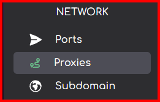

import { Callout } from 'nextra/components'

# How to create a Reverse Proxy on your service
***
<Callout type="info" >
  A reverse proxy allows you to mask a service that is running under a port on your Minecraft server. This is most useful with plugins which use a port that users should access like Dynmap. It converts the URL from  `x.x.x.x:25678` to `my.domain.com`.
</Callout>
## How to create a Reverse Proxy on Andromeda

**1.** On the sidebar on the left-hand side of Andromeda click "Proxies"

**2.** Click on the button labled "Create Proxy"

**3.** Fill in the "domain" field and select the allocation (port) your service, for example Dynmap, is running on, finally select the `Auto Generate SSL certificate` toggle if you want an SSL cerfificate to be generated.
<Callout type="warning" emoji="⚠️">
  We advise only users with advanced knowlege uncheck the `Auto Generate SSL certificate` toggle. If you do not know what you are doing and you uncheck this it can cause issues.
</Callout>

**4.** Andromeda will now create a reverse proxy fo this service and you can now access it using the domain you setup.

***

Article created by: Mac G.

***

Should you require any further assistance feel free to pop [open a ticket](https://billing.plutonode.com/submitticket.php) and a member of our team will assist further
