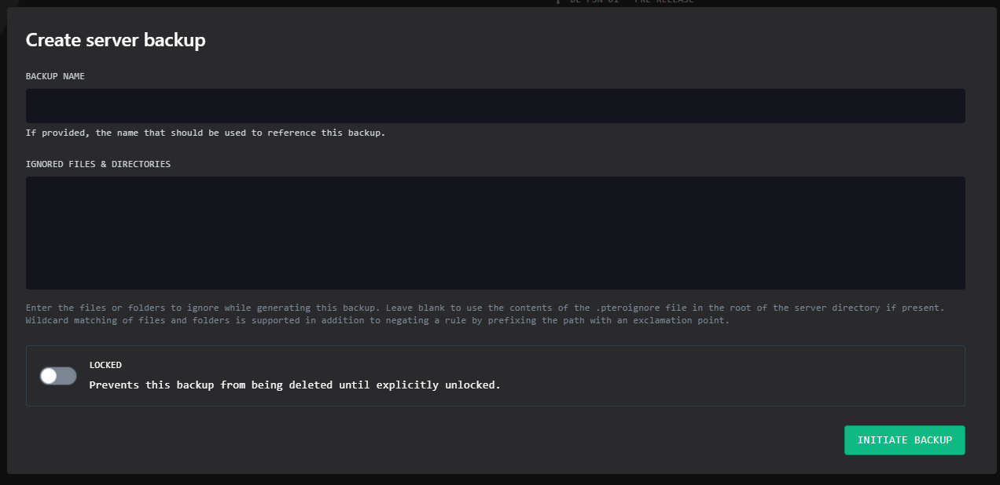

import { Callout } from 'nextra/components'
import { Steps } from 'nextra/components'

# How to Create A Backup on the Andromeda Panel
***
<Callout type="info" emoji=" " >
The backup system on the Andromeda panel provides manual, on-demand data backups with secure storage, ensuring data protection and recovery in case of data corruption or accidental deletion.
</Callout>
## How to Create Backups on Andromeda
<Steps>
### On the sidebar on the left-hand side of Andromeda click "Backups"

### Click on the "Create Backup" button

* A modal will open with all the fields to be filled in.

* these fields are not required but to aid in location of backups a name is helpful here.
* Click `Inititate Backup` to start the backup

### The backup will now be created

</Steps>
***

Article created by: Mac G.

***

Should you require any further assistance feel free to pop [open a ticket](https://billing.plutonode.com/submitticket.php) and a member of our team will assist further
