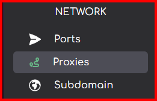

import { Callout } from 'nextra/components'
import { Steps } from 'nextra/components'

# How to create a Reverse Proxy on your service
***
<Callout type="info" emoji=" " >
  A reverse proxy allows you to mask a service that is running under a port on your Minecraft server. This is most useful with plugins which use a port that users should access like Dynmap. It converts the URL from  `x.x.x.x:25678` to `my.domain.com`.
</Callout>
## How to create a Reverse Proxy on Andromeda
<Steps>
###  On the sidebar on the left-hand side of Andromeda click "Proxies"

###  Click on the button labled "Create Proxy"

###  Fill in the "domain" field and select the allocation (port) your service, for example Dynmap, is running on, finally select the `Auto Generate SSL certificate` toggle if you want an SSL cerfificate to be generated.
<Callout type="warning" emoji=" " >
  We do not advise users uncheck the `Auto Generate SSL certificate` toggle. If your service requires an SSL certificate and you have unchecked this option you will have to delete and re-create this reverse proxy.
</Callout>

###  Andromeda will now create a reverse proxy fo this service and you can now access it using the domain you setup.
</Steps>

## How to delete a Reverse Proxy on Andromeda

Deleting a reverse proxy is a simple process, this guide will walk you through it.

To deletea reverse proxy click the `"Delete"` button on the right-hand side.

This will open a context menu prompting you to confirm the reverse proxy deletion.  You are required to entire the reverse proxy name to prevent accidental deletion.

***

Article created by: Mac G.

***

Should you require any further assistance feel free to pop [open a ticket](https://billing.plutonode.com/submitticket.php) and a member of our team will assist further
