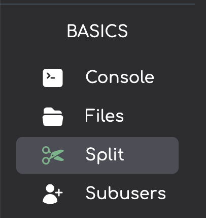

import { Callout } from 'nextra/components'

# Splitting a service on Andromeda
***
<Callout type="info" emoji=" " >
  Server splitting is an excellent feature that enables you to divide your main server (the parent server) into multiple smaller servers. This is particularly useful in large networks. This article will guide you on how to use the server splitter feature on Andromeda.
</Callout>

## Creating a split server
**1.** On the sidebar on the left-hand side of Andromeda click "Split"

**2.** Click on "Split". This will open a context menu where you can fill in the following values for your sub-server;
* Server Ram - the amount of ram to allocate to the sub server in MegaBytes. This will be the total removed from the parent server.
* Server Disk - the amount of disk space to allocate to the sub server in MegaBytes. This will be the total removed from the parent server.
* Server Name - the name to assign to the sub server. This will be used to identify and differentiate the parent and sub-servers.
* Add Existing Subusers - this will copy all subusers you have on the parent server and grant them access to the sub-server.

## Accessing your sub-server

To access your sub-server either;
* click on it's name on the sub-servers row 
or
* click on the external arrow button next to the sub-servers name

***

Article created by: Mac G.

***

Should you require any further assistance feel free to pop [open a ticket](https://billing.plutonode.com/submitticket.php) and a member of our team will assist further
