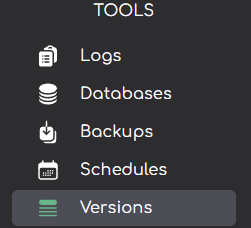
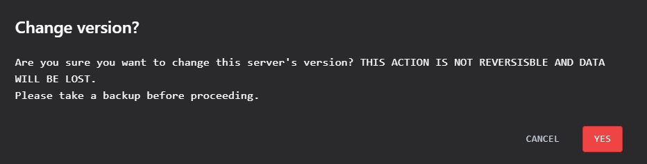

import { Callout } from 'nextra/components'
import { Steps } from 'nextra/components'

# Changing versions on Andromeda
***
<Callout type="info"  emoji=" " >
  Andromeda's version changer lets you easily switch between different game server versions, ensuring compatibility and access to the features you need.
</Callout>
<Steps>
## Changing Your Server Version
<Callout type="error" emoji=" " >
 We strongly urge users to take backups before switching server versions.  **Any dataloss caused by switching versions is not PlutoNode LTD's responsibility.**
</Callout>
### On the sidebar on the left-hand side of Andromeda click "Versions"

### Locate the Server Software you would like to run, in the table below select a Jar Version.  

*More server versions are avaliable, this image was taken on a pre-production build of Andromeda*

Leave the `"Keep Files"` button un-toggle if you are just replacing the server software but are maintaining the same server version.    However, if you are changing server version click the  `"Keep Files"`, it will become red and will read `"Delete Files"` 

### Click the `"install"` button, this will open a context menu.    

**This will be your last chance to cancel a version change**  

</Steps>
***

Article created by: Mac G.

***

Should you require any further assistance feel free to pop [open a ticket](https://billing.plutonode.com/submitticket.php) and a member of our team will assist further
