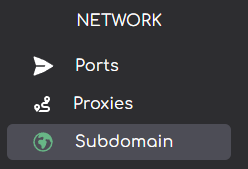

import { Callout } from 'nextra/components'

# Creating a Server Subdomain on Andromeda
***
<Callout type="info" emoji=" " >
  Server splitting is an excellent feature that enables you to divide your main server (the parent server) into multiple smaller servers. This is particularly useful in large networks. This article will guide you on how to use the server splitter feature on Andromeda.
</Callout>

## Creating a Subdomain
**1.** On the sidebar on the left-hand side of Andromeda click "Subdomain"

**2.** Click on "Split". This will open a context menu where you can fill in the following values for your subdomain;
* SUBDOMAIN - The prefix for your subdomain, `subdomain.plutohost.xyz` or `subdomain.pluto-mc.com`
* DOMAIN - the root domain to use for your subdomain, either `plutohost.xyz` or `pluto-mc.com`

Your subdomain will now be created by Andromeda and deployed on the domain you specified on creation.

## Deleting a subdomain

To delete a subdomain click the `"Delete"` button on the right-hand side.

This will open a context menu prompting you to confirm the subdomain deletion.

***

Article created by: Mac G.

***

Should you require any further assistance feel free to pop [open a ticket](https://billing.plutonode.com/submitticket.php) and a member of our team will assist further
