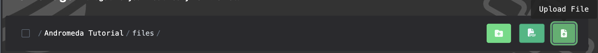
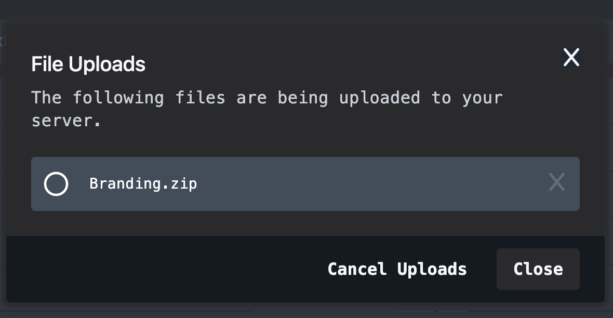

import { Callout } from 'nextra/components'

# How to Upload A File on the Andromeda Panel
***
<Callout type="info" emoji=" " >
  The Andromeda Panel's file uploading feature allows users to effortlessly transfer and manage their folders and files with a simple drag-and-drop interface. This user-friendly system ensures secure and swift uploads, providing seamless integration with Andromeda's file management tools.
</Callout>
## How to Upload Files on Andromeda

**1.** On the sidebar on the left-hand side of Andromeda click "Files"

**2.** Click on the "Upload" button

**3.** Select the files you would like to upload to your server, in our case the file we are uploading is `branding.zip`

Andromeda will now upload the file(s) you selected to your server, a cloud icon will apear allowing you can check upload status.

*The image above showcases the cloud icon menu after being clicked*

**3.** You're files are now uploaded to your server.

***

Article created by: Mac G.

***

Should you require any further assistance feel free to pop [open a ticket](https://billing.plutonode.com/submitticket.php) and a member of our team will assist further
